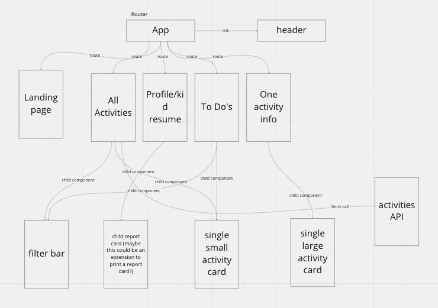

<a name="readme-top">Testing </a>

## Contributors

[![El][el-badge]][el-url]
[![Sarah][sarah-badge]][sarah-url]
[![Faye][faye-badge]][faye-url]
[![Patt][patt-badge]][patt-url]

<br />
<div align="center">
  <a href="https://play-pals-6o0yfn85r-elbrewster.vercel.app/">
		
  </a>

<h3 align="center">PlayPals</h3>

  <p align="center">
   PlayPals
    <br />
    <a href="https://github.com/ElBrewster/PlayPals"><strong>Explore the docs »</strong></a>
    <br />
    <br />
    <a href="https://github.com/ElBrewster/PlayPals/issues">Report Bug</a>
    ·
    <a href="https://github.com/ElBrewster/PlayPals/issues">Request Feature</a>
  </p>
</div>

<details>
  <summary>Table of Contents</summary>
  <ol>
    <li>
      <a href="#about-the-project">About The Project</a>
      <ul>
        <li><a href="#built-with">Built With</a></li>
      </ul>
    </li>
    <li>
      <a href="#getting-started">Getting Started</a>
      <ul>
        <li><a href="#installation">Installation</a></li>
      </ul>
    </li>
    <li><a href="#architecture">Architecture</a></li>
    <li><a href="#roadmap">Roadmap</a></li>
  </ol>
</details>

## About The Project

### Preview

PlayPals is the perfect app for first time moms who are struggling to come up with ideas on safe, fun, and stimulating activities for their child. PlayPals gives a list of activities with that can be filtered through to give you ideas for inside or outside play. The activities are also seperated by gross and fine motor skills.

<p align="right">(<a href="#readme-top">back to top</a>)</p>

## Getting Started

### Installation
1. Fork the Repo from the [Repository](https://github.com/ElBrewster/PlayPals)
2. Clone the repo
   ```sh
   git clone https://github.com/ElBrewster/PlayPals
   ```
3. Install NPM packages
   ```sh
   npm install
   ```
4. Run npm start
   ```sh
   npm start
   ```
5. Use the Link that is given in the Terminal & Open in Browser
   ```sh
   Example: http://localhost:3000/
   ```

## App site
[PlayPals](https://play-pals-6o0yfn85r-elbrewster.vercel.app/)

<p align="right">(<a href="#readme-top">back to top</a>)</p>

<!-- ARCHITECTURE -->

## Architecture

<p align="right">(<a href="#readme-top">back to top</a>)</p>
<!-- ROADMAP -->



## Roadmap

See the [open issues](https://github.com/ElBrewster/PlayPals/issues) for a full list of proposed features (and known issues).

<p align="right">(<a href="#readme-top">back to top</a>)</p>

## Future Additions

1. Adding more users
1. More activities
1. Printing each child's resume
1. Adding more filters to filter search

<p align="right">(<a href="#readme-top">back to top</a>)</p>

### Built With

- [![Npm][npm]][npm-url]
- [![Javascript][javascript.js]][javascript-url]
- [![CSS][css]][css-url]
- [![Sass][sass]][sass-url]
- [![HTML][html]][html-url]
- [![Cypress][cypress]][cypress-url]
- [![Webpack][webpack]][webpack-url]
- [![API][api]][api-url]
- [![Postgres][postgres]][postgres-url]
- [![Express][express]][express-url]
- [![Docker][docker]][docker-url]
- [![Git][git]][git-url]
- [![GitHub][github]][github-url]
- [![React][react]][react-url]
- [![React-router][react-router]][react-router-url]
- [Knex][knex-url]
<p align="right">(<a href="#readme-top">back to top</a>)</p>

[el-badge]: https://img.shields.io/badge/-El%20Brewster-orange
[el-url]: https://github.com/ElBrewster
[patt-badge]: https://img.shields.io/badge/-Patt%20Sookmark-brightgreen
[patt-url]: https://github.com/pattpjy
[sarah-badge]: https://img.shields.io/badge/-Sarah%20Hampton-blue
[sarah-url]: https://github.com/SHampton22
[faye-badge]: https://img.shields.io/badge/-Faye%20Rosenshein-lightgrey
[faye-url]: https://github.com/FayeRosenshein
[webpack]: https://img.shields.io/badge/Webpack-563D7C?style=for-the-badge&logo=webpack&logoColor=white
[webpack-url]: https://webpack.js.org/
[css]: https://img.shields.io/badge/CSS-000000?style=for-the-badge&logo=css&logoColor=white
[css-url]: https://www.w3.org/Style/CSS/Overview.en.html
[html]: https://img.shields.io/badge/HTML-4A4A55?style=for-the-badge&logo=HTML&logoColor=FF3E00
[html-url]: https://www.w3schools.com/howto/howto_make_a_website.asp
[javascript.js]: https://img.shields.io/badge/JavaScript-0769AD?style=for-the-badge&logo=javascript&logoColor=white
[javascript-url]: https://www.javascript.com/
[api]: https://img.shields.io/badge/API-15EA75?style=for-the-badge&logo=HTML&logoColor=FF3E00
[api-url]: https://www.w3schools.com/js/js_api_intro.asp
[github]: https://img.shields.io/badge/GitHub-22043C?style=for-the-badge&logo=github&logoColor=FF3E00
[github-url]: https://github.com/
[git]: https://img.shields.io/badge/Git-2E0305?style=for-the-badge&logo=git&logoColor=FF3E00
[git-url]: https://git-scm.com/
[react]: https://shields.io/badge/react-black?logo=react&style=for-the-badge
[react-url]: https://reactjs.org/
[cypress]: https://shields.io/badge/cypress-4A4A55?logo=cypress&style=for-the-badge
[cypress-url]: https://www.cypress.io/
[knex-url]:https://knexjs.org/
[postgres]:https://img.shields.io/badge/postgres-%23316192.svg?style=for-the-badge&logo=postgresql&logoColor=white
[postgres-url]:https://www.postgresql.org/
[express-url]:https://expressjs.com/
[express]:https://img.shields.io/badge/express.js-%23404d59.svg?style=for-the-badge&logo=express&logoColor=%2361DAFB
[docker-url]:https://www.docker.com/
[docker]:https://img.shields.io/badge/docker-%230db7ed.svg?style=for-the-badge&logo=docker&logoColor=white
[react-router-url]:https://reactrouter.com/en/main
[react-router]:https://img.shields.io/badge/React_Router-CA4245?style=for-the-badge&logo=react-router&logoColor=white
[sass]:https://img.shields.io/badge/SASS-hotpink.svg?style=for-the-badge&logo=SASS&logoColor=white
[sass-url]: https://sass-lang.com/
[npm]:https://img.shields.io/badge/NPM-%23CB3837.svg?style=for-the-badge&logo=npm&logoColor=white
[npm-url]:https://www.npmjs.com/
